# Go Money
A Simple Expense Tracker App 📱 built to demonstrate the use of AutoLayout, Realm, Charts, Biometrics (Face & Touch ID), Export CSV, Widget and MVVM Architecture 🏗. *Made with love ❤️ by [Paul](https://github.com/paul-nguyen-goldenowl)*

<br />

## UI Design 🎨


***Click to View GoMoney app Design from below 👇***

[](https://www.behance.net/gallery/150426215/My-Expense-Mobile-App-Case-Study)

<br />
## Screenshot 📸

| Home                 | Profile                 | Statitics            | Add                 | Detail                 |
| -------------------- | ----------------------- | -------------------- | ------------------- | ---------------------- |
| 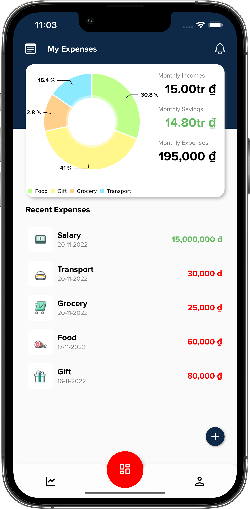 | 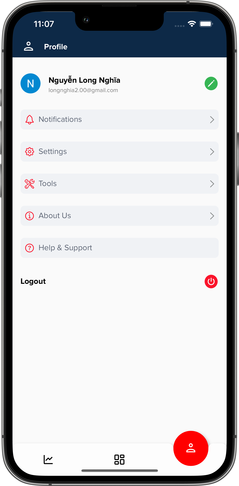 | 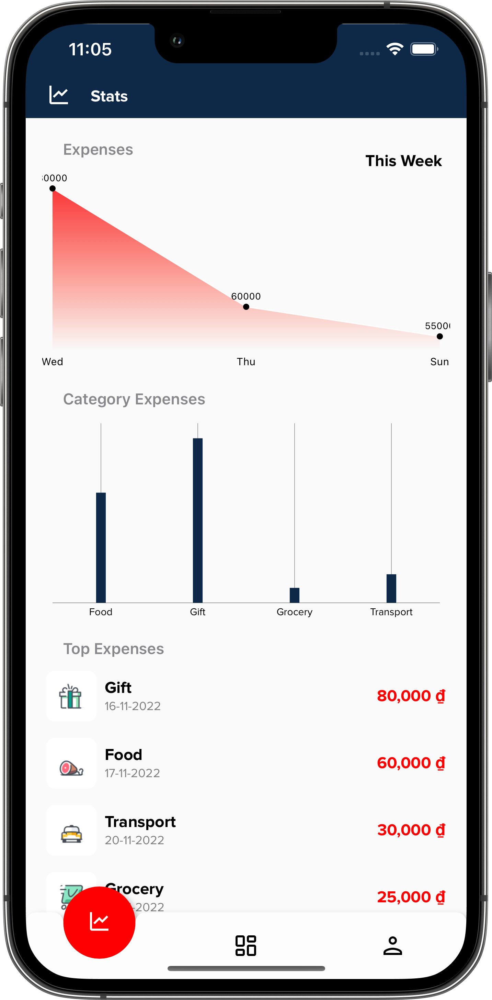 | 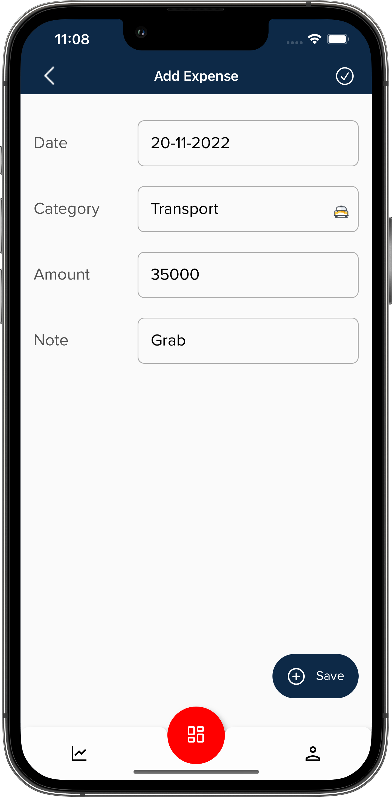 | 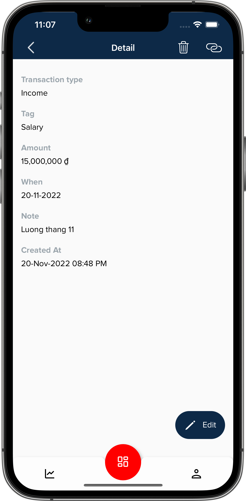 |

| Biometric                 | Custom Category                 | Widget                 | Sharing                 | Sync                 |
| ------------------------- | ------------------------------- | ---------------------- | ----------------------- | -------------------- |
| 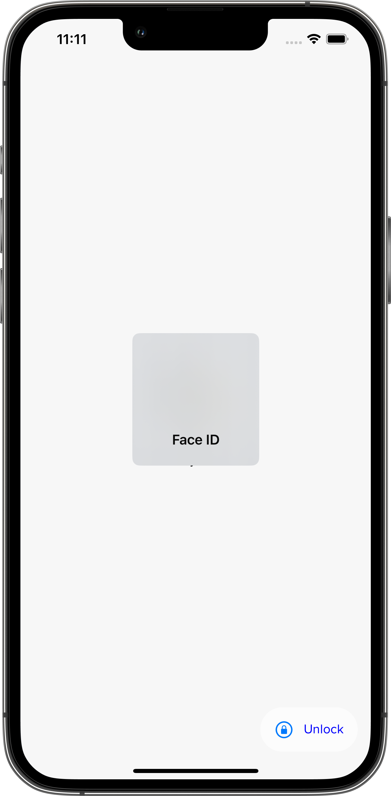 | 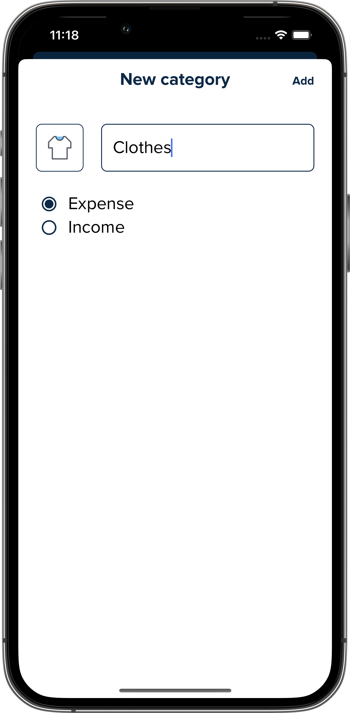 | 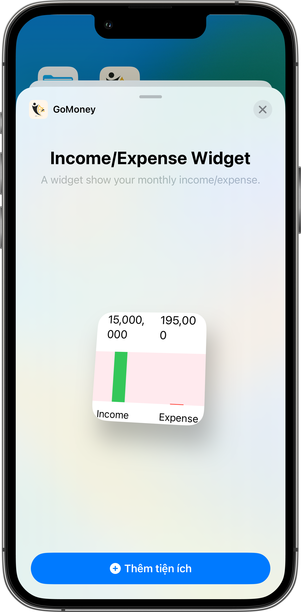 | 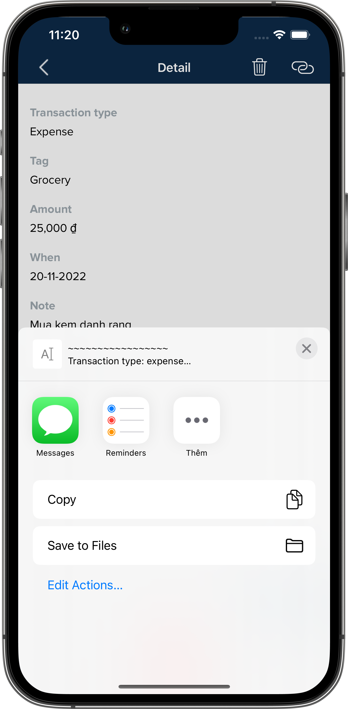 | 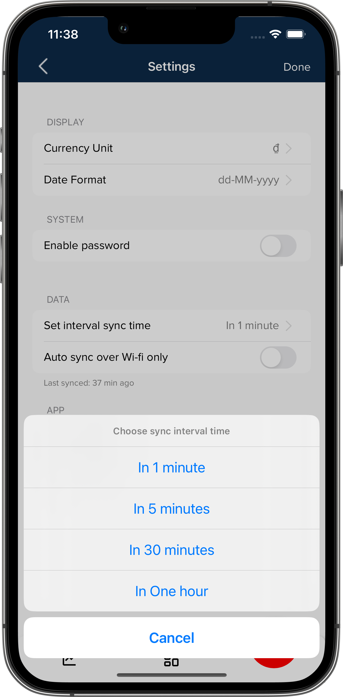 |

| Settings                | Tools                 | Caculator                  | Exchanger              | Export                    |
| ----------------------- | --------------------- | -------------------------- | ---------------------- | ------------------------- |
| 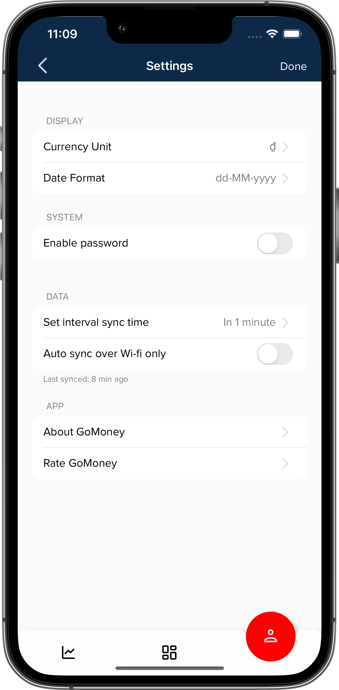 | 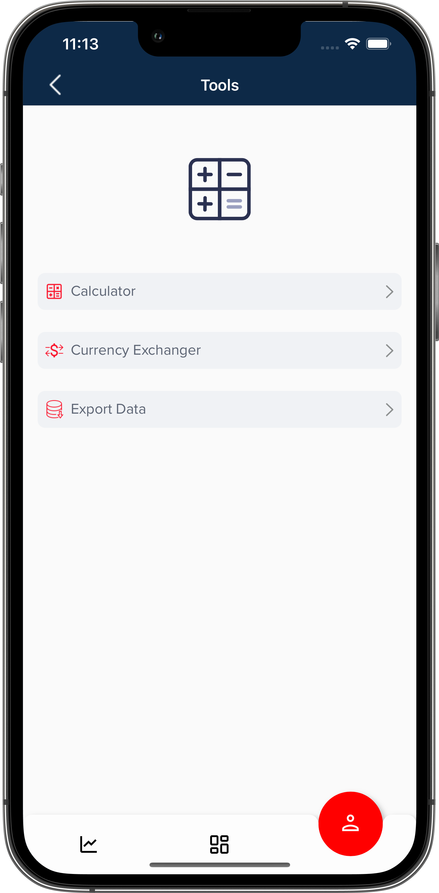 | 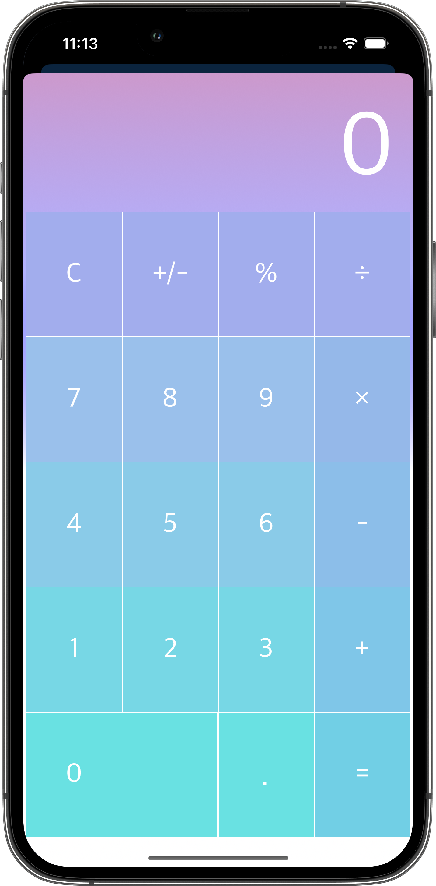 | 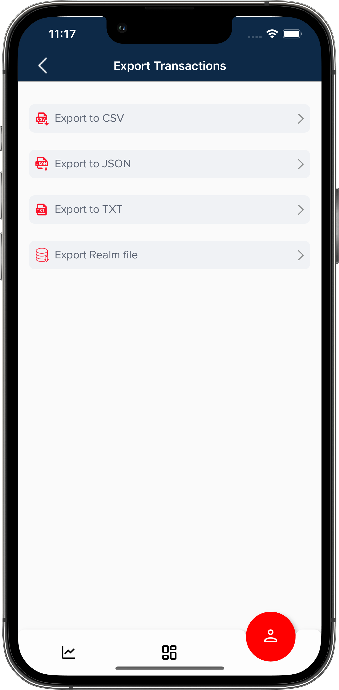 |  |


<br />
## Project Structure 🏗

    ├── GoMoney
    │   ├── Base
    │   │   ├── GMMainViewController.swift
    │   │   └── GMViewController.swift
    │   ├── Base.lproj
    │   │   └── LaunchScreen.storyboard
    │   ├── Common
    │   │   ├── AsyncImage
    │   │   ├── Chart
    │   │   ├── FileHelper
    │   │   ├── TabBar
    │   │   └── View
    │   ├── Constants
    │   │   ├── Constant.swift
    │   │   └── UserDefaultKey.swift
    │   ├── Extensions
    │   │   ├── Date+Extension.swift
    │   │   ├── UIView+Constraint.swift
    │   │   └── UIViewController+Extension.swift
    │   ├── Models
    │   │   ├── CurrencyUnit.swift
    │   │   ├── DateFormat.swift
    │   │   ├── Expense.swift
    │   │   ├── TransactionTag.swift
    │   │   └── TransactionTracking.swift
    │   ├── Navigation
    │   │   ├── GMTabBarViewController.swift
    │   │   └── MainNavigationController.swift
    │   ├── Scences
    │   │   ├── AddExpense
    │   │   ├── Auth
    │   │   ├── Calculator
    │   │   ├── Detail
    │   │   ├── Home
    │   │   ├── Profile
    │   │   ├── Setting
    │   │   └── Stat
    │   ├── Service
    │   │   ├── AuthService.swift
    │   │   ├── BiometricService.swift
    │   │   ├── ConnectionService.swift
    │   │   ├── DataService.swift
    │   │   ├── ExchangeService.swift
    │   │   ├── RemoteService.swift
    │   └── ViewModel
    │       ├── AddExpense
    │       ├── Auth
    │       ├── Detail
    │       ├── Home
    │       └── Stat
    ├── Podfile
    ├── Shared
    │   └── Model
    │       ├── UserDefaults+AppGroup.swift
    │       └── Widget+Kind.swift
    ├── WidgetExtension
    │   ├── IncomeWidget
    │   │   └── IncomeWidget.swift
    │   └── WidgetBundle.swift
    └── readme.md

<br />

## Built With 🛠
- Logics Libraries
  - [AutoLayout](https://developer.apple.com/library/archive/documentation/UserExperience/Conceptual/AutolayoutPG/index.html) - Auto Layout dynamically calculates the size and position of all the views in your view hierarchy, based on constraints placed on those views..
  - [Realm](https://github.com/realm/realm-swift) - Realm is a mobile database: a replacement for Core Data & SQLite 
  - [Charts](https://github.com/realm/realm-swift) - Beautiful charts for iOS/tvOS/OSX! The Apple side of the crossplatform MPAndroidChart.  
  - [BiometricAuthentication](https://github.com/rushisangani/BiometricAuthentication) - Use Apple FaceID or TouchID authentication in your app using BiometricAuthentication.
  - [ReachabilitySwift](https://github.com/ashleymills/Reachability.swift) - Replacement for Apple's Reachability re-written in Swift with closures

- UI Libraries
  - [VBRRollingPit](https://github.com/v-braun/VBRRollingPit) - Simple, beautiful and interactive UITabBar 
  - [Lottie](https://github.com/airbnb/lottie-ios) - An iOS library to natively render After Effects vector animations
  - [TTGSnackbar](https://github.com/zekunyan/TTGSnackbar) - TTGSnackbar shows simple message and action button on the bottom or top of the screen with multi kinds of animation
  - [RadioGroup](https://github.com/yonat/RadioGroup)  - iOS radio buttons group
  - [Floaty](https://github.com/kciter/Floaty/) - Floating Action Button for iOS  
  - [DropDown](https://github.com/AssistoLab/DropDown) - A Material Design drop down for iOS 
  - [SCLAlertView](https://github.dev/vikmeup/SCLAlertView-Swift) - Beautiful animated Alert View. Written in Swift 

<br />

## UI References 👀
- https://github.com/sag333ar/InputViews
- https://github.com/edgar-zigis/CocoaTextField
- https://github.com/perekrist/Calculator
- https://github.com/tirupati17/currency-converter-swift3.0-viper
- https://github.com/sameersyd/Expenso-iOS
- https://github.com/mozilla-mobile/focus-ios
- https://github.dev/vitaliy-paliy/Messenger

<br />

## License

```
    Apache 2.0 License


    Copyright 2022 Paul Nguyen

    Licensed under the Apache License, Version 2.0 (the "License");
    you may not use this file except in compliance with the License.
    You may obtain a copy of the License at

       http://www.apache.org/licenses/LICENSE-2.0

    Unless required by applicable law or agreed to in writing, software
    distributed under the License is distributed on an "AS IS" BASIS,
    WITHOUT WARRANTIES OR CONDITIONS OF ANY KIND, either express or implied.
    See the License for the specific language governing permissions and
    limitations under the License.
```